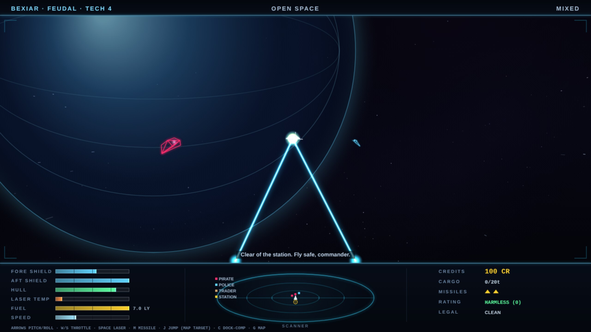

# NEON ELITE

Ninth game in the harsh-critic-loop series, after
[NEONOID](https://github.com/melvincarvalho/neonoid),
[NEON MINER](https://github.com/melvincarvalho/neonminer),
[NEODROID](https://github.com/melvincarvalho/neodroid),
[NEON DASH](https://github.com/melvincarvalho/neondash),
[NEONLINGS](https://github.com/melvincarvalho/neonlings),
[NEOPOLIS](https://github.com/melvincarvalho/neopolis),
[NEON SCORCH](https://github.com/melvincarvalho/neonscorch) and
[NEON MASTER](https://github.com/melvincarvalho/neonmaster). An Elite
tribute: 100 credits, a Kestrel, and forty-eight seeded worlds that do
not care. Wireframe 3D on a bare canvas, pitch-and-roll-only flight,
typed economies with real price spreads, witch-space between the stars,
pirates with bounties on both sides of the ledger, and the slot on the
spinning station that must be met roll-for-roll. Original hulls and
worlds — the real Elite (Braben & Bell, 1984) is copyrighted, and
revered here.

**Play it: <https://melvincarvalho.github.io/neonelite/>**



**There are no assets.** Every pixel and every sound is generated from
code. Two files: `index.html`, `game.js`. Arrows pitch and roll, W/S
throttle, Space fires, M launches a missile, G opens the chart, J jumps
to the charted star. Docked: 1 status, 2 market, 3 outfitting, 4 chart,
L launch. Buy low on green agricultural worlds; sell high on orange
industrial ones. Climb from HARMLESS to ELITE.

```bash
python3 -m http.server 8000   # or just open index.html
```

## The experiment

Same pipeline as the first eight games — one owner builds, deterministic
`?shot=` captures, four harsh sub-agent critics (three visual lenses plus
an Elite-fidelity judge), honest scores — and the harness's next species
of proof: **voyages as theorems.** Not one level, one god, or one duel,
but a whole career, replayed and verified headlessly every build.

`tools/playtest.sh` proves 17 claims:

- **the trader bot must get rich by reading the economy**: price-driven
  routes and honest roll-matched dockings turned 100 cr into 2,581 cr
  across 6 legs (+414/leg);
- **a random commander must NOT get rich** — the null trader limped to
  13 cr — poorer than launch day after refuels;
- **ablate-economy** (smart routes, blind cargo picks) **died broke
  with a hold full of worthless goods** — reading prices is
  load-bearing;
- **the duel bot kills a pirate untouched; the sitting duck dies in 12
  shots**;
- **the aligned docker DOCKS clean; the deliberately-crooked docker is
  ground off the spinning hull in 10 scrapes** — the slot's roll-match
  is real physics, not a cutscene;
- **10 mechanism proofs**: food costs 3 cr where it grows and 8 where
  it doesn't, machinery the reverse; a 0.86 LY jump burns exactly
  0.86 LY of fuel and out-of-range jumps are refused; market invariants
  and the cargo cap; laser damage; missile locks that kill; bounties
  that pay and count; the rating ladder's endpoints; shooting a trader
  makes you a fugitive; the station never stops turning; and two axes
  of pitch and roll provably close any pursuit angle (2.1 rad → 0.01).

## Scores

| round | composition | game-feel | HUD | visual mean | Elite fidelity |
|---|---|---|---|---|---|
| 1 (final) | 4.4 | 2.6 | 4.5 | **3.8** | 5.5 |

Final-round verdicts: fidelity — *"the two hardest things to get right —
the pitch/roll frame and the spinning slot — are right, and provably
so… a harness whose control run exposed a real damage-model bug is
doing science, not theater."* Composition — *"a tasteful HUD skeleton…
fix the lies and light the void."* Game-feel — *"Elite's math and none
of its blood."* A post-panel batch answered the sharpest cuts: a
streaming 3D starfield with speed streaks; enemy fire became visible,
dodgeable bolts with directional hit flashes; lasers now fire from
hardpoints, converge on the true hit point, and spark on impact; ships
die by fragmenting into tumbling wireframe edges and the player's death
is a 1.6-second tumble before SIGNAL LOST; the docking computer now
flies the real slot approach instead of bypassing it (the fidelity
critic's "450 cr buys immortality" cheat is gone); prices became a pure
stateless hash so the rendered world and the proven world share one RNG
stream; the market's G-key theft, the stale-message lies, the map
legend collision, and the low-value bar floor were all fixed; the
scanner gained a legend, a heading wedge, and taller altitude stalks;
docked screens gained clickable tabs. All 17 theorems re-verified after
every change. The scores above are the panel's, judged before those
fixes.

## Honest assessment

- **One critic round** — the scores are a floor, not a ceiling.
- **Two of the mechanism proofs are near-tautologies** (laser-hit and
  station-rotation assert the code's own constants); the fidelity
  critic flagged them and they are kept with that caveat.
- **48 systems in one galaxy** vs canon's 256×8; no fuel scooping, no
  Thargoids, no cargo scooping, no escape pod, no galactic hyperdrive.
- **One purchasable ship** — the Kestrel is your only hull.
- Encounters spawn on system entry rather than continuously; space is
  emptier than canon between stations.
- Staged evidence shots are separate deterministic runs, not one
  continuous playthrough.

## Process notes

1. **The steering signs were wrong and the harness knew before I did.**
   The hand-derived pitch/roll pursuit diverged (2.1 rad opened to
   2.77); the fix was to make steering sign-agnostic — probe candidate
   micro-rotations and keep whichever closes the angle — immune to
   handedness mistakes by construction. The docking theorems passed
   minutes later.
2. **The null gunner survived 334 landed hits**, shields serenely full.
   The shields were gates, not pools: one regenerated point absorbed an
   entire 57-point volley. Making overflow damage pass through to the
   hull fixed the theorem — and the game.
3. **The null trader was outrunning its executioners.** Launch left the
   throttle at 0.35, and jackals fly slower than a Kestrel at cruise;
   the "sitting duck" control was winning an eternal stern chase. The
   duck now sits.
4. **The dock leads with technique, like 1984**: the bot lines up on
   the axis first with free steering, and only roll-matches the spin in
   the final approach — because with the roll locked early, pitch alone
   cannot correct lateral drift. The machine had to learn the same
   lesson every human pilot did.

## License

Copyright © 2026 Melvin Carvalho.

Licensed under the [GNU Affero General Public License v3.0 or later](LICENSE)
(AGPL-3.0-or-later).
